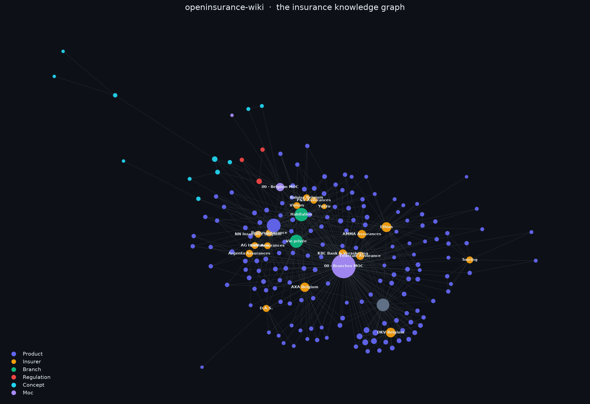
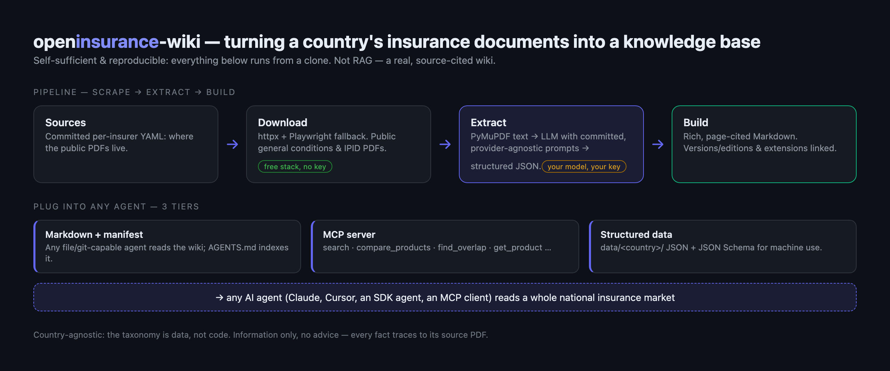

# openinsurance-wiki

> **A brain for a country's insurance market.** A self-sufficient, open-source, country-agnostic framework that
> turns a nation's public insurance documents into a rich, interconnected, source-cited knowledge base that any
> AI agent can read.

Not a chatbot. Not a RAG black box. A **transparent, reproducible knowledge graph**: the repo contains the whole
chain - it finds insurers' public general-conditions PDFs, downloads them, and turns each one into a faithful
Markdown page that preserves the maximum of what the PDF actually says, with a citation back to the source - all
cross-linked into a navigable graph of products, insurers, branches, regulations and concepts.

<p align="center">
  
</p>

As far as we know, this is the **only open-source, machine-readable, source-cited database of insurance
products** (the closest equivalents are commercial and closed). Point it at **any country**: the taxonomy is
data, not code, and adding a country is a documented recipe. The first reference dataset already covers
**24 insurers and 269 products across 17 branches** in Belgium (auto, home, health, liability, travel, legal
protection, ...), each page cited to its source document.

---

## Use it in 2 minutes - no API key needed

The dataset **ships in the repo, already built**: 269 product pages, insurer pages, glossary, plus the
structured JSON behind them. You only need an LLM key to *re-extract from scratch*, never to *use* it.

**1. Browse it.** Open the repo as an [Obsidian](https://obsidian.md) vault (the `[[wikilinks]]` become a
navigable graph). Note: github.com does not render `[[wikilinks]]` as links, so the vault or the website is
the comfortable way to read.

**2. Plug it into an agent (MCP).** The MCP server is keyless and read-only:

```bash
git clone https://github.com/sluyasu/OpenInsurance.git
cd OpenInsurance
python3 -m venv .venv && .venv/bin/pip install "mcp[cli]" pyyaml
```

Then register it with any MCP client, e.g. Claude Code:

```bash
claude mcp add insurance-wiki -- "$(pwd)/.venv/bin/python" "$(pwd)/mcp/insurance_wiki_mcp.py"
```

You get `search`, `get_product`, `get_coverage` (only what's relevant to one question, with verbatim quotes),
`compare_products`, `find_overlap` (candidate duplicate cover when combining two policies), `verify_claim`
(verbatim evidence for a fact-check), `get_branch_overview`, ... See [`mcp/README.md`](mcp/README.md).

**3. Take the raw data.** `data/be/extracted/` holds one structured JSON per source document, validated
against [`schema/`](schema/); `data/be/index.json` is the flat index. `AGENTS.md` is a generated manifest
(note types, counts, per-page `path` / `source_url` / `freshness`) so a file-reading agent can navigate
without guessing.

---

## How it works

<p align="center">
  
</p>

## Why an MCP server (and not a chatbot, a RAG stack or a REST API)

The goal is that **any** AI agent can answer insurance questions from documents it can cite. That constraint
picks the architecture.

**Why MCP.** The [Model Context Protocol](https://modelcontextprotocol.io) is the standard socket between AI
assistants and data: one server, and Claude, ChatGPT, Cursor or your own agent plugs in with three lines of
config instead of a custom integration. This server is **keyless** (no account, no API key, no quota),
**read-only**, and needs **zero hosting**: the dataset is the repo itself, so the data travels with a
`git clone` and works offline. When the wiki is re-extracted, `git pull` is the upgrade path.

**Why not a RAG chatbot.** A chatbot is a single interface; a knowledge base should serve many (a broker's
comparison tool, a compliance check, a market-mapping agent). RAG adds an embedding index that is a black box:
you cannot diff it, review it in a PR, or reproduce it, and its retrieval errors are invisible. Here the
retrieval layer is deterministic matching over reviewed, committed files: the same query returns the same
documents every time, and every answer carries the source PDF and page numbers. The LLM stays where it
belongs, on the client side, reasoning over exact excerpts.

**Why not a REST API.** An API means a server running 24/7, uptime, keys, versioning, and one bespoke
integration per consumer, for a dataset that changes a few times a year. MCP gives the same programmatic
access at the cost of a local process.

**How it works, in four stages:**

1. **Sources** (`sources/`): committed YAML saying where each insurer's public PDFs live.
2. **Frozen extraction** (`data/`): each PDF turned once into structured JSON and cited Markdown, by a prompt
   that is itself committed. Nothing is generated at query time.
3. **Deterministic MCP server** (`mcp/`): 10 read-only tools over those files. No LLM inside, no network, no
   state. Same input, same output.
4. **A reasoning client**: the agent on top (Claude, a broker chatbot, a script) does the semantic work,
   quoting what the tools return.

The trust boundary is explicit: everything below stage 4 is reproducible and auditable. Hallucination risk is
confined to the client, and the tool responses are shaped to keep that client honest: a grounding contract and
a front-loaded citation line in every single-product response, refusal of ambiguous product names (with the
candidates listed) instead of silent guessing, and a `verify_claim` tool so an agent can fact-check its own
draft against the document before answering. See the
[response discipline notes](mcp/README.md#what-keeps-the-answering-llm-honest) in the server docs.

**How fast.** The server reads every file once and serves from memory: warm latencies run 0.01 to about 3 ms
per tool on this dataset (measured, reproducible: [`mcp/README.md`](mcp/README.md#measured-latency)). In a real
chatbot the time a user feels is the LLM's own inference, not these tools.

## Why this exists

Insurance products are documented in dense PDFs scattered across dozens of insurer websites. There is no
neutral, machine-readable, navigable map of what actually exists in a national market. This project builds
one - as a public good, and in a form an AI agent can plug into.

It also plugs into a market that is standardizing around it: EU regulation 2017/1469 gives every non-life
product a standardized summary (the **IPID**), EIOPA actively promotes product comparison and switching, and
the **open insurance** agenda (OPIN, the EU FIDA proposal) pushes for machine-readable access to insurance
data. This project is the missing *public documents* layer of that picture: what the products actually say,
in the open.

Three things make it different:

1. **Self-sufficient & reproducible.** Clone it, add your own LLM key, run `make all`. It scrapes, downloads
   and extracts from scratch. No hidden datasets - every input is committed, every output is regenerable.
2. **Transparent extraction.** The exact prompt sent to the LLM is a file in this repo
   ([`extraction-agent/`](extraction-agent/)), not buried in code. You can read precisely what the model was
   asked, and run the identical extraction **with your own model** (Claude, Gemini, GPT, or a local model).
3. **Grounded & cited.** Every product page traces back to the source PDF and cites page numbers. Quotes are
   verified against the raw text. If it isn't in the document, it isn't on the page.

---

## What's in the wiki

Per country (`wiki/be/`):

| Folder | What | How it's made |
|---|---|---|
| `products/<insurer>/` | One rich page per insurance product (general conditions / IPID) | **Generated** from the PDFs |
| `insurers/` | One page per insurer, aggregating its products | **Generated** |
| `branches/` | Overview of each line of insurance (every populated branch has one; `make validate` lists any gap) | **Hand-authored** |
| `regulations/` | The regulator and key laws (FSMA, mandatory RC auto, cat-nat...) | **Hand-authored** |
| `glossary/` | Country-specific terms (bonus-malus, franchise, Branche 21/23...) | **Hand-authored** |

Generated and hand-authored pages live in **separate folders** and never collide: you fix a fact by editing the
extraction data and rebuilding, never by editing a generated page.

Every page is Obsidian-compatible Markdown with YAML frontmatter and `[[wikilinks]]`.

---

## Reproduce it from scratch

This is the only path that needs an LLM key (the extraction step). Scraping and download use a free stack
(`httpx` + `Playwright`).

```bash
git clone https://github.com/sluyasu/OpenInsurance.git
cd OpenInsurance
make setup                      # deps + playwright chromium (no paid scraping dependency)
cp .env.example .env            # set LLM_PROVIDER + your API key (any provider)

# Reproduce a slice end-to-end:
make download COUNTRY=be INSURER=<slug>   # fetch the public PDFs
make extract  COUNTRY=be INSURER=<slug>   # PDFs -> rich Markdown + JSON (uses YOUR model)
make build    COUNTRY=be                  # assemble the wiki
make validate COUNTRY=be                  # citation / wikilink / frontmatter gates

# ...or the whole chain:
make all COUNTRY=be
```

Extraction is resumable (skip-existing keyed by source checksum + prompt version), so large runs can stop and
restart safely.

## How the pipeline works

```
sources/be/<insurer>.yml     (committed: where the public PDFs live)
        │  discover.py   crawl listing pages (httpx, Playwright fallback)
        ▼
data/be/pdfs/…               (downloaded; gitignored - regenerable; manifest.json committed)
        │  extract.py    PyMuPDF text  ──►  LLM (extraction-agent/ prompts)  ──►  MD + JSON
        ▼
data/be/extracted/…          (rich Markdown + structured JSON, page-cited)
        │  build_wiki.py
        ▼
wiki/be/…                    (the browsable, agent-readable knowledge base)
```

Details: [`CONTRIBUTING.md`](CONTRIBUTING.md) (how to add a country / insurer / product) and
[`extraction-agent/`](extraction-agent/) (the exact prompts).

Every push runs the CI gates: wiki validation (frontmatter, wikilinks, citations) and build idempotence
(rebuilding the committed wiki must produce a zero diff).

---

## Add a country

1. `sources/<cc>/_country.yml` - regulator, languages, branch taxonomy.
2. `sources/<cc>/<insurer>.yml` - where each insurer's public PDFs live.
3. `wiki/<cc>/` - hand-author branch/regulation/glossary overviews (or start them as stubs).
4. `make all COUNTRY=<cc>`.

Nothing in the schema is Belgium-specific - the taxonomy is data, not structure.

---

## Licensing & provenance

Dual-licensed: **code** ([pipeline/](pipeline/), [mcp/](mcp/), adapters, schema) under **MIT**; **original
content** (`wiki/`, extracted data, prompts, sources) under **CC-BY-4.0**. Short verbatim excerpts quoted from
insurers' public documents remain the property of their publishers and are **not** relicensed - see
[`LICENSE`](LICENSE), [`LICENSE-CONTENT`](LICENSE-CONTENT) and [`NOTICE`](NOTICE).

Product pages are a factual extraction from insurers' **publicly published** documents, attributed to each source
PDF. **They are not the insurers' official documents** and may contain extraction errors - always verify against
the cited `source_url`. This project provides **information, not personalized insurance advice**.
